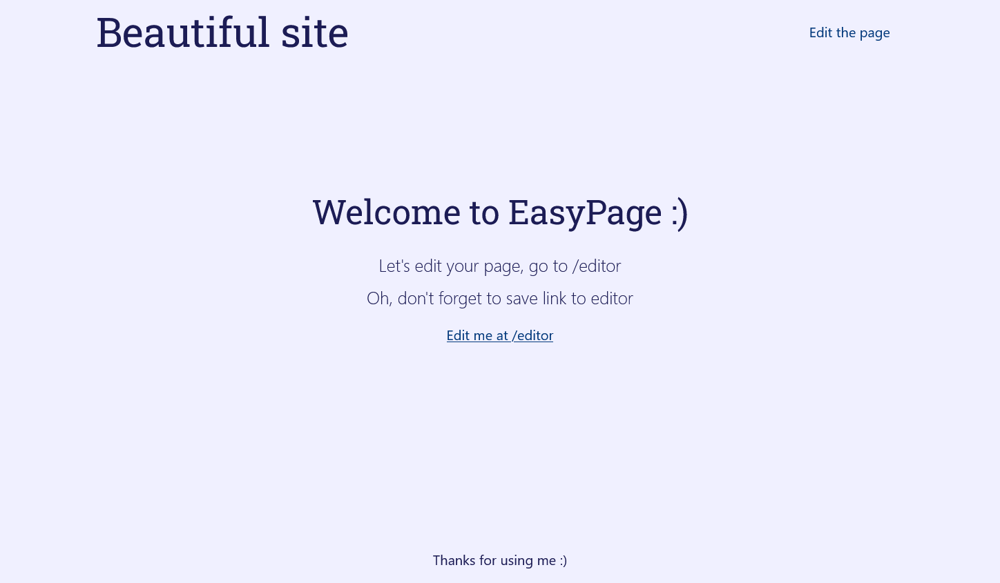

# Easy stub page CMS

This is an easy-to-use package to use on your new domain as a stub-page.
There a only 3 steps, that you should do:

- Download package
- Upload files to your hosting
- Set up your data

It's so easy! Your domain are awesome now.

Just couple of minutes to make oyur domain ready to be wekk known by search engines.
Tell them: "I'm here! There will be soon an awesome site!".
Or, insead, if you want: "Nope. Please, don't crawl now, I'm not ready". It's also available.

# Some details

## Why there is no database connector

It's because whole project developed to be used without a complicated setup.
It may appear here later, or you may develop it and make a push request

## Why the vendor folder is published

It's published here to make the project easy-to-use, and contains only an autoloader.

## Why there are two composer.json files

It's linked to the statement above: second composer configuration is used for development environmet,
to make tests available in distribution, but to exclude the files from export
